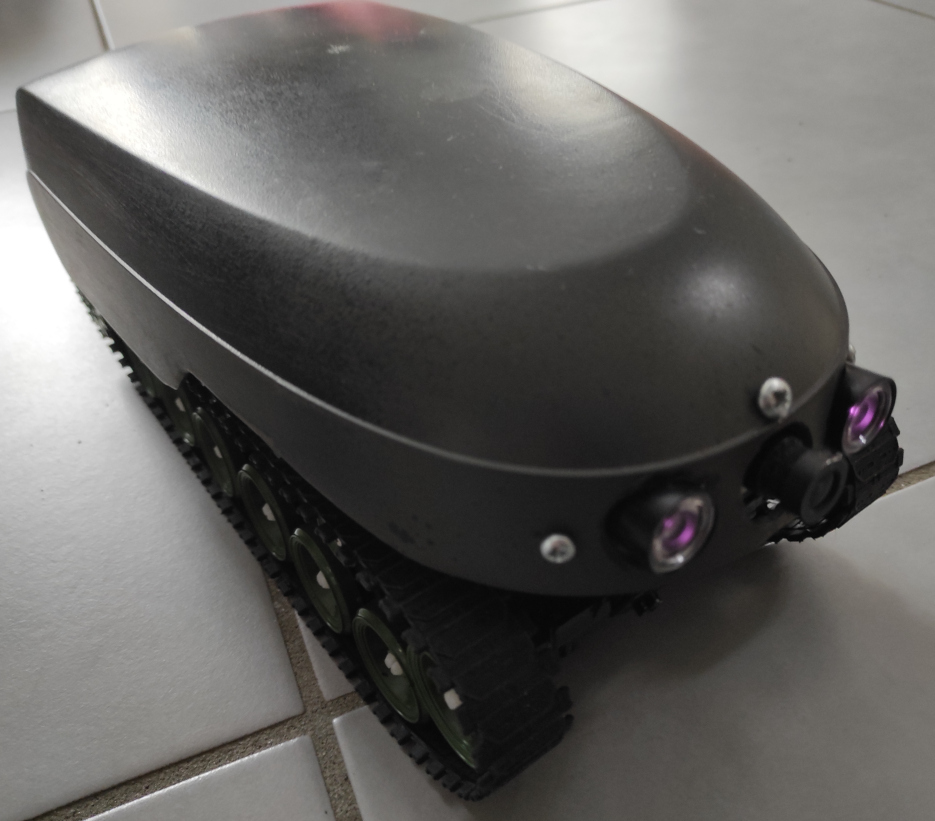
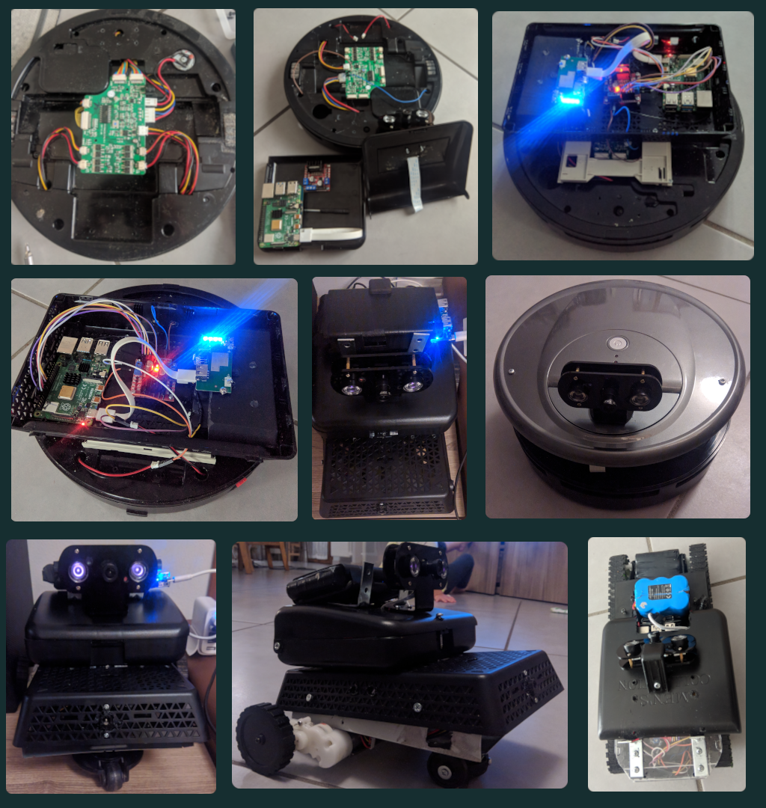
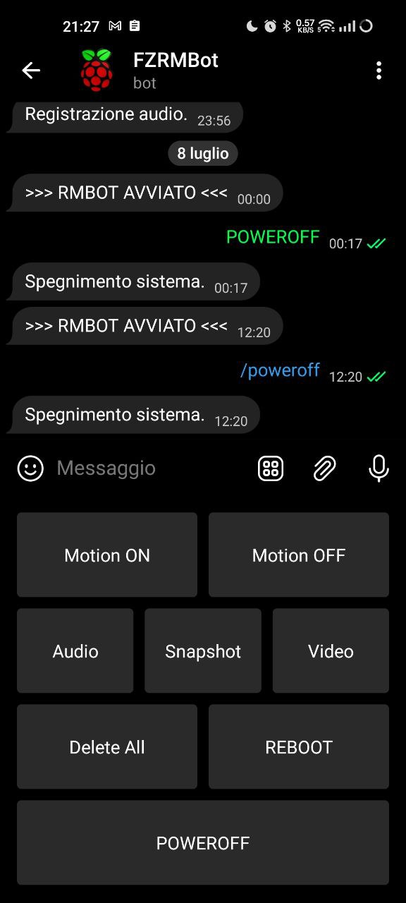
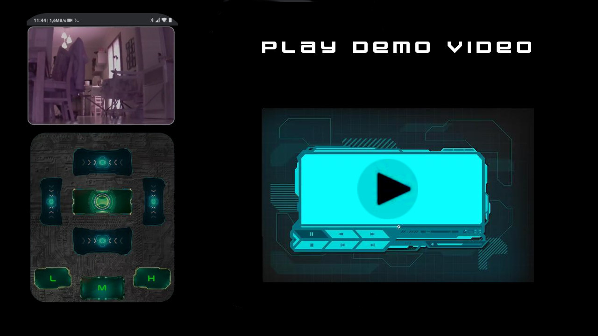
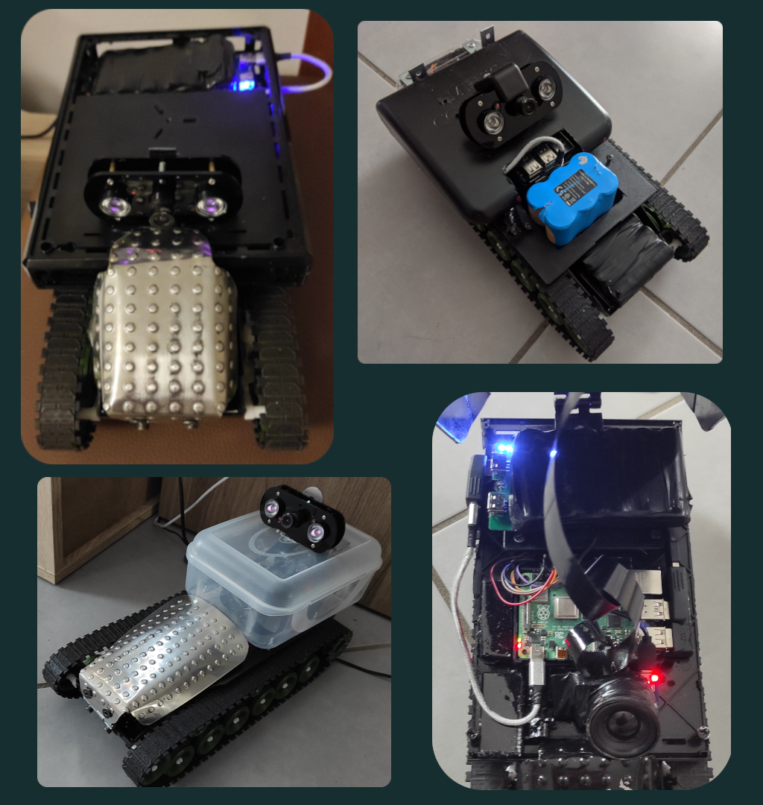
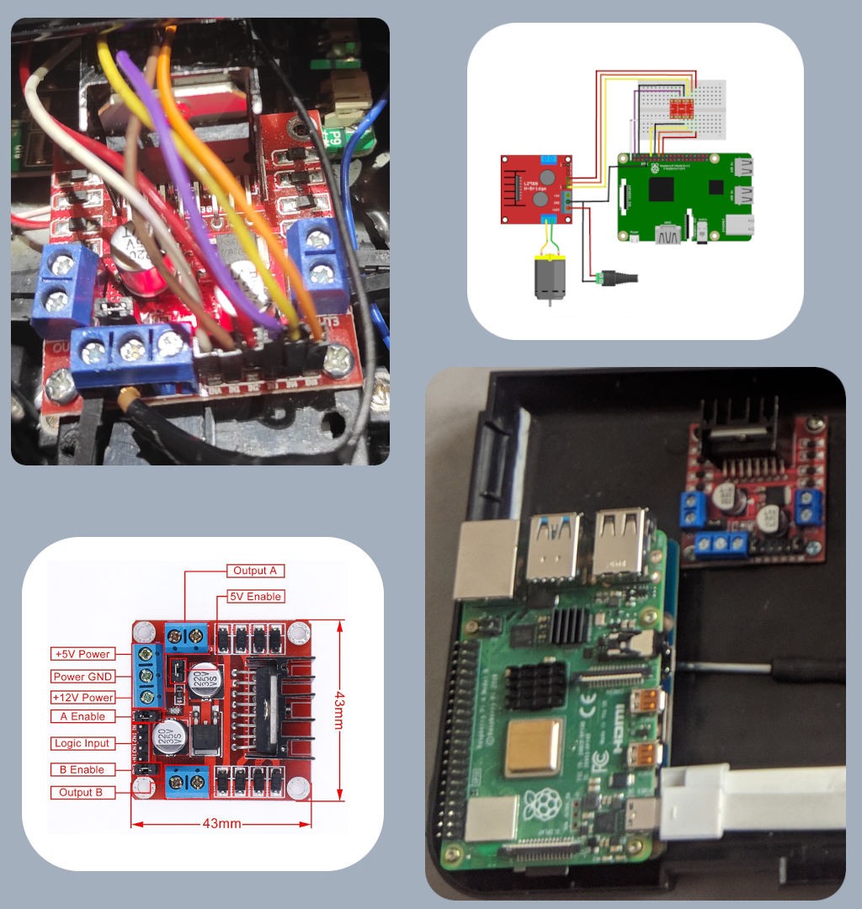
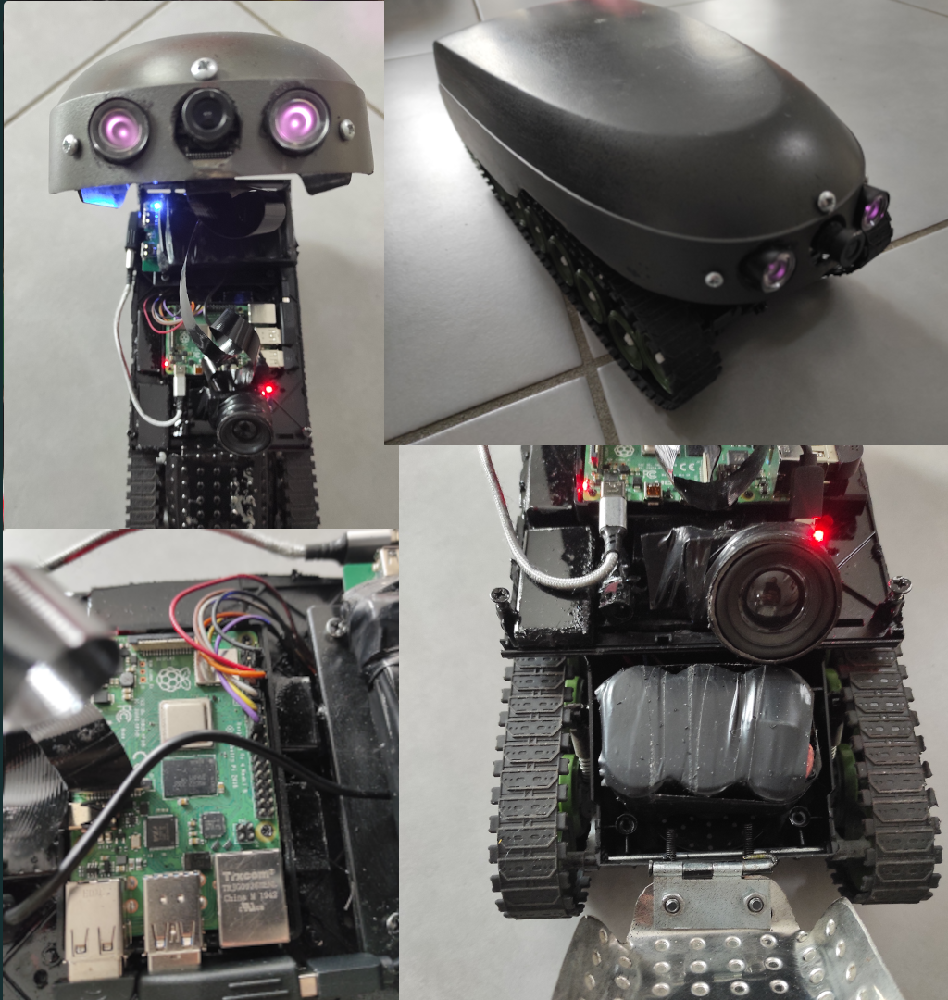

# ScrappyBot
   

Ecco dei piccoli script in Python per il controllo del mio robot, forgiato con un Raspberry Pi 4B, dei cingoli giocattolo e... pezzi di fortuna.

Per il Bot Telegram devo ringraziare Mr. Francesco Tucci, che mi ha ispirato nell'impresa, e dal cui repo - essendo io un totale noob in materia di programmazione - ho preso svariate righe di codice, modificandolo poi a mio uso e consumo. Il suo è più completo, e permette di usare un solo token.

Cito quindi il sito del suo progetto: [www.ladomoticafaidame.it](http://www.ladomoticafaidame.it) e il blog in cui ne spiega le specifiche: https://www.iltucci.com/blog/la-domotica-fai-da-me

## 1 - robot_basics.py

Controlla i pin GPIO che ho collegato al L298N (un dual controller per motori, anche detto H-bridge).

## 2 - RMBot.py

E' un piccolo Telegram Bot, e dipende da Motion (https://motion-project.github.io). Permette di avviare/fermare il motion detection, catturare istantanee, cancellare tutti i media presenti nel path specificato in motion.conf, controllare i movimenti del robot e la sua velocità, acquisire brevi registrazioni audio/video.

## 3 - REyeBot.py

Va inserito nella config di Motion (nel mio caso, on_picture_save /usr/bin/python /path/to/REyebot.py).

Invia all'amministratore del sistema le istantanee e i video acquisiti da Motion, e una breve registrazione audio quando rileva movimento.

Dopo l'invio, cancella tutti i file multimediali.

Motion deve essere correttamente configurato affinché funzioni (target e filename, soglie di attivazione, abilitazione istantanee e video preview).

## 4 - kbd_control.py

Controllo del robot mediante la tastiera di PC, smartphone o tablet (via SSH/VNC/Anydesk, etc.) oppure con una tastiera WiFi/Bluetooth.
Le frecce direzionali controllano i movimenti del robot:

 **UP_ARROW** = avanti

 **DOWN_ARROW** = indietro

 **LEFT_ARROW** = sinistra

 **RIGHT_ARROW** = destra

La **barra spaziatrice** arresta i motori.

Il **tasto 'i'** permette di inserire caratteri che poi il robot pronuncerà (occore installare il motore di sintesi vocale Espeak e le voci aggiuntive Mbrola - ho usato it3).

### ACQUISIZIONE CONTENUTI MULTIMEDIALI:

**Tasto 'p'** = scatta un'instantanea e la invia alla chat Telegram specificata.

**Tasto 'r'** = registra un file audio di 10 secondi e lo invia alla chat Telegram specificata.

**Tasto 'v'** = registra un file video di 5: secondi e lo invia alla chat Telegram specificata.

#### VELOCITA' MOTORI:

**h** = velocità massima (high)

**m** = velocità media (medium)

**l** = velocità ridotta (low)

Il **tasto 'q'** interrompe l'esecuzione dello script.

#### 4 - tgSend.py

Contiene le funzioni necessarie all'esecuzione degli script precedentemente descritti.

#### 5 - streamCam.Py

Avvia l'anteprima della PICam e la rende disponibile all'IP locale del Raspberry (porta 8080) nel browser di qualsiasi periferica connessa alla rete locale.

#### 6 - VRStream.Py

Come "streamCam.py", ma l'anteprima viene visualizzata in due immagini adiacenti. In questo modo, se inseriamo lo smartphone in un visore per la realtà virtuale/aumentata, potremo controllare il robot in FPV.

